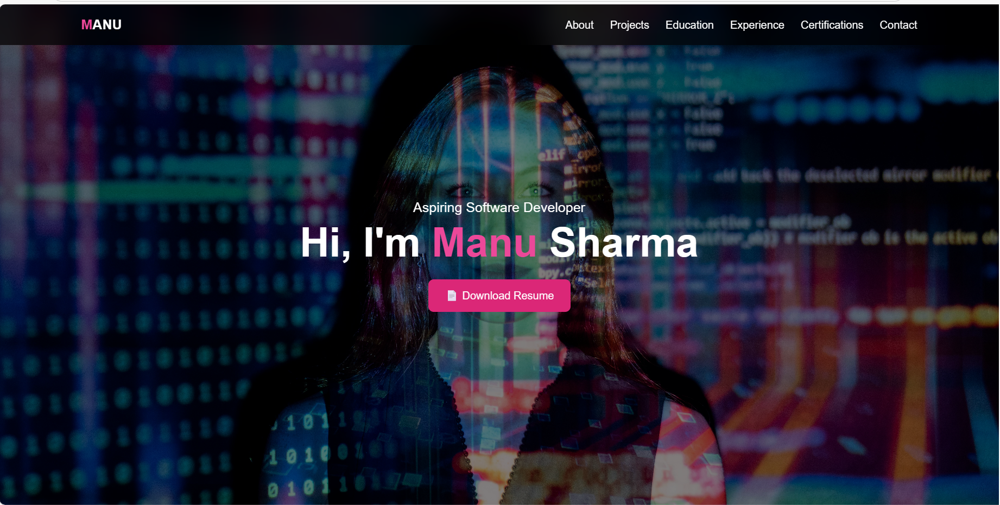

# 🌟 My Portfolio

## 👋 Introduction
Hi, I’m **Manu Sharma** — a passionate aspiring **Software Developer**.  
This is my personal portfolio website where I showcase my skills, projects, and contact details.  
I aim to create beautiful, functional, and responsive web applications.

---

## 🖼 Preview
 <!-- Replace with actual screenshot path -->

---

## 🚀 Live Demo
[**View My Portfolio**](https://manusharma82.github.io/my-portfolio/)

---

## 🛠 Technologies Used
- **HTML5**
- **CSS3**
- **JavaScript**
- **Tailwind CSS** 
- Responsive Design

---

## 📂 Features
- Responsive & mobile-friendly design  
- About Me section  
- Skills showcase  
- Project gallery  
- Contact information  

---

## 📦 Installation & Setup
If you want to run this project locally:

```bash
# Clone the repository
git clone https://github.com/ManuSharma82/my-portfolio.git

# Go inside the folder
cd my-portfolio

# Open index.html in your browser

## 📬 Contact Me
- **Email:** [manusharma8164@gmail.com](mailto:manusharma8164@gmail.com)
- **LinkedIn:** [linkedin.com/in/manu-sharma8218](https://linkedin.com/in/manu-sharma8218)
- **GitHub:** [github.com/ManuSharma82](https://github.com/ManuSharma82)

---

## 📝 License
This project is **open-source** and available under the [MIT License](LICENSE).